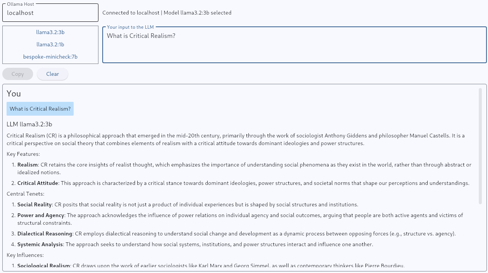

# Chatter

## in Python & Flutter

Here is a version of `Chatter` implemented in Python with the following libraries:

1. `ollama`: Library to access a running Ollama service
1. `flet`: Library to access Flutter UI widgets

### UX & UI

```text
+============================================+
| [ <Ollama Host Input> ] (<Connect Button>) |
|  <Connection Status String>                |
| [ <Available Models Dropdown>]             |
| +-----------------------------+            |
| |   <Prompt Multiline Input>  |            |
| +-----------------------------+            |
| (<Copy>) (<Clear>)                         |
| +-----------------------------+            |
| | <Chat in Most Recent First> |            |
| +-----------------------------+            |
+============================================+
```

The section that displays the Chat should be in reverse order, meaning the user's most recent prompt and the LLMs reply should be first. Also, it should be scrollable.

