# User Stories

## User Story: Engaging in a Conversation with the AI Chatbot

> As a user of the Svelte chatbot application, I want to select a specific AI model and engage in a conversation with the AI chatbot,
so that I can receive relevant and meaningful responses to my inquiries.

### Acceptance Criteria

1. The user should be able to select an AI model from the available options.
2. The user should be able to enter their message in the provided textarea.
3. The user should be able to generate an AI response by pressing Ctrl + Enter or clicking the generate button.
4. The AI's response should be displayed in the chat history, along with the user's message.
5. The chat history should be scrollable to view the entire conversation.
6. The user should be able to copy the entire chat history by holding the Ctrl key and clicking on the chat history area.

### Sequence Diagram

```mermaid
sequenceDiagram
    participant User
    participant UI
    participant API

    User->>UI: Select AI model
    UI->>API: Fetch available models (GET /api/tags)
    API-->>UI: Return available models
    UI-->>User: Display available models

    User->>UI: Enter message
    User->>UI: Press Ctrl + Enter or click generate button
    UI->>API: Send user message and selected model (POST /api/chat)
    API->>API: Generate AI response
    API-->>UI: Return AI response
    UI-->>User: Display AI response in chat history

    User->>UI: Scroll chat history
    UI-->>User: Display entire conversation

    User->>UI: Hold Ctrl key and click on chat history
    UI-->>User: Copy entire chat history to clipboard
```

In this sequence diagram:

1. The user selects an AI model from the available options in the UI.
2. The UI sends a GET request to the API endpoint `/api/tags` to fetch the available models.
3. The API returns the available models to the UI.
4. The UI displays the available models to the user.
5. The user enters their message in the provided textarea.
6. The user presses Ctrl + Enter or clicks the generate button to generate an AI response.
7. The UI sends a POST request to the API endpoint `/api/chat` with the user's message and the selected model.
8. The API generates an AI response based on the user's message and the selected model.
9. The API returns the AI response to the UI.
10. The UI displays the AI response in the chat history, along with the user's message.
11. The user can scroll the chat history to view the entire conversation.
12. The user can copy the entire chat history to the clipboard by holding the Ctrl key and clicking on the chat history area.

### Use Case 1: Engaging in a Conversation with the AI Chatbot

Actor: User

Preconditions:

  - The user has access to the Svelte chatbot application.
  - The API endpoints ("/api/chat" and "/api/tags") are available and functional.

Main Flow:

  1. The use case begins when the user opens the Svelte chatbot application.
  2. The system displays the user interface, including the title "Chatter", a textarea for user input, and a list of available AI models.
  3. The user selects an AI model from the available options by clicking on the corresponding model element.
  4. The system highlights the selected model using a dynamic gradient background.
  5. The user enters their message in the provided textarea.
  6. The user presses Ctrl + Enter or clicks the generate button to generate an AI response.
  7. The system sends a POST request to the API endpoint "/api/chat" with the user's message and the selected model.
  8. The API generates an AI response based on the user's message and the selected model.
  9. The API returns the AI response to the system.
  10. The system displays the AI response in the chat history, along with the user's message.
  11. The system automatically scrolls the chat history to the bottom to show the latest message.
  12. The user can repeat steps 5-11 to continue the conversation with the AI chatbot.

Alternative Flows:

  3a. If no AI model is selected, the system displays an alert message "No model selected." and prompts the user to select a model.
  7a. If the API request fails or returns an error, the system displays an appropriate error message to the user and logs the error for debugging purposes.

Postconditions:

  - The user's message and the AI's response are displayed in the chat history.
  - The chat history is scrollable, allowing the user to view the entire conversation.

Non-Functional Requirements:

  - The system should respond to user actions within 1 second to ensure a smooth user experience.
  - The system should be able to handle multiple users simultaneously without performance degradation.
  - The system should ensure the privacy and security of user data during transmission and storage.

Acceptance Criteria:

  - The user can select an AI model from the available options.
  - The user can enter their message in the provided textarea.
  - The user can generate an AI response by pressing Ctrl + Enter or clicking the generate button.
  - The AI's response is displayed in the chat history, along with the user's message.
  - The chat history is scrollable to view the entire conversation.
  - The system handles errors gracefully and displays appropriate error messages to the user.

Metrics:

  - Response Time: The system should generate an AI response within 3 seconds of receiving the user's message.
  - Concurrent Users: The system should support up to 100 concurrent users without significant performance degradation.
  - Availability: The system should have an uptime of at least 99.5% to ensure reliable access to the chatbot functionality.
